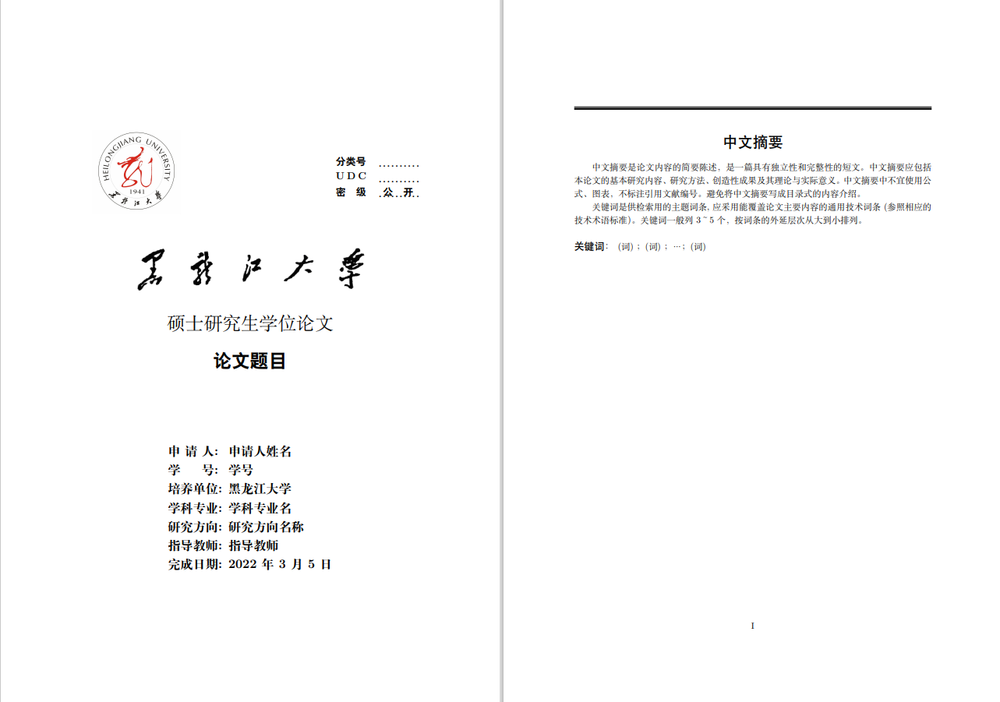
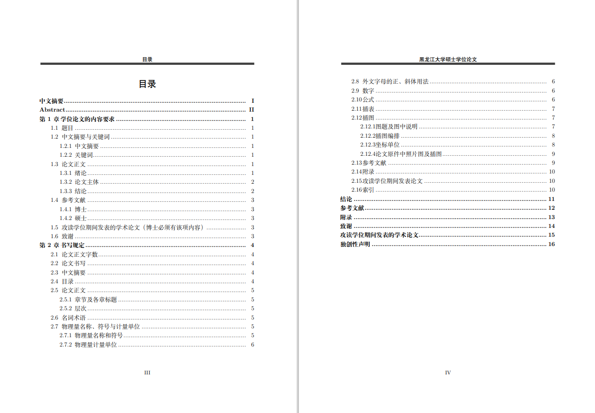
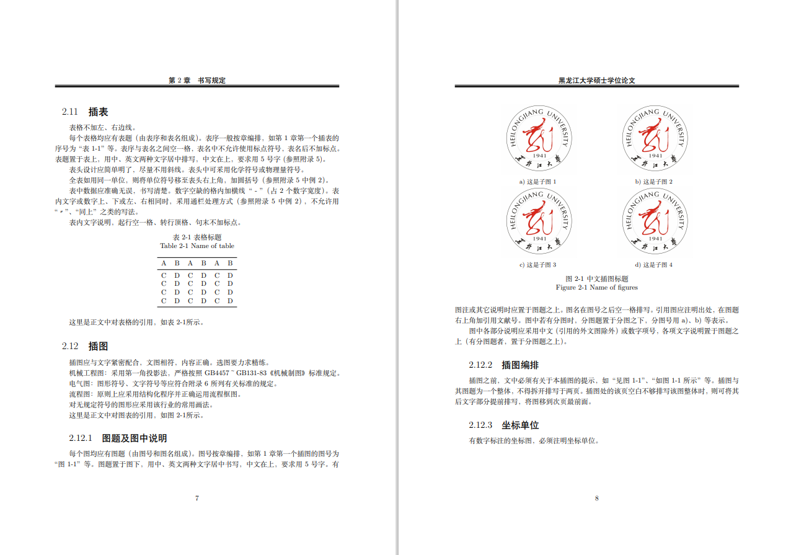
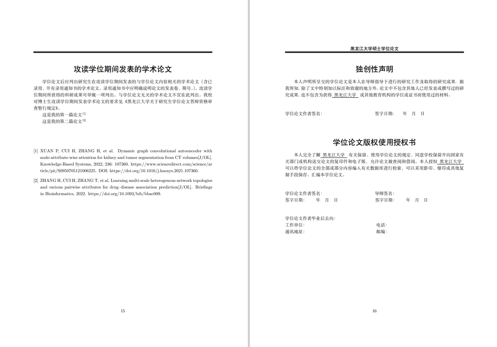

# 黑龙江大学研究生学位论文撰写$\LaTeX$模板（理科）





## 如何使用
根据论文内容，本模板将$\LaTeX$模板拆分为多个部分。各部分内容如下边所示，撰写论文时只需将内容添加到相应的文件中。
|文件名称|文件内容|
|-------|--------|
|main.tex|论文封面、作者及论文信息、模板格式设置及相关内容组织|
|abs_zh.tex|中文摘要|
|abs_en.tex|英文摘要|
|symbols.tex|符号表|
|body.tex|论文正文部分|
|conclusion.tex|结论|
|appendix.tex|附录|
|thanks.tex|致谢|
|achievement.tex|个人学术成果及论文|
|references.bib|引用论文数据库|
|img/*|论文插图|

### 插入论文名字及作者信息

模板在`main.tex`中定义了论文题目、作者等信息，用于生成封面。

```latex
\newcommand{\lwtm}{论文题目}
\newcommand{\shenqingren}{申请人姓名}
\newcommand{\xuehao}{学号}
\newcommand{\xkzy}{学科专业名}
\newcommand{\yjfx}{研究方向名称}
\newcommand{\zdjs}{指导教师}
\newcommand{\wcrq}{\today}
```
只需在相应的位置修改信息即可。如:
```latex
\newcommand{\lwtm}{药物重定位方法研究}
\newcommand{\shenqingren}{张三}
```
### 插图

插图要求使用中英文双语标题，请按如下插图模板插入，并使用`\bicaption{中文插图标题}{Name of figures}`生成双语标题。
```latex
\begin{figure}[h]
    \centering
    \subcaptionbox{这是子图1 \label{Fig:1a}}[.4\textwidth]
    {\includegraphics[width=40mm]{img/hlju_logo.jpg}}
    \subcaptionbox{这是子图2 \label{Fig:1b}}[.4\textwidth]
    {\includegraphics[width=40mm]{img/hlju_logo.jpg}}
    \subcaptionbox{这是子图3 \label{Fig:1c}}[.4\textwidth]
    {\includegraphics[width=40mm]{img/hlju_logo.jpg}}
    \subcaptionbox{这是子图4 \label{Fig:1d}}[.4\textwidth]
    {\includegraphics[width=40mm]{img/hlju_logo.jpg}}
    \bicaption{中文插图标题}{Name of figures}
    \label{Fig:1}
\end{figure}
```
在引用插图时，请使用模板预定义指令`\tupian{Fig:x}`代替`\biaoge{Tab:1}`来插入图片，使得引用格式“图 2-1”生效。
```latex
这里是正文中对表格的引用，如\tupian{Fig:x}所示。
```

### 插表

插表要求使用双语标题，请参照如下模板，并使用`\bicaption{中文插图标题}{Name of figures}`生成双语标题。
```latex
\begin{table}[h]
    \bicaption{表格标题}{Name of table}
    \label{Tab:1}
    \centering
    \begin{tabular}{cccccc}
        \toprule
        A & B &A & B &A & B\\
        \midrule
        C & D & C & D & C & D\\
        C & D & C & D & C & D\\
        C & D & C & D & C & D\\
        C & D & C & D & C & D\\
        \bottomrule
    \end{tabular}
\end{table}
```
为使引用格式生效，请使用预定义命令`\biaoge{Tab:1}`代替`\ref{Tab:1}`。
```latex
这里是正文中对表格的引用，如\biaoge{Tab:1}所示。
```
### 公式

文中引用公式时，一般用“见式(1-1)”或“由公式(1-1)”。

模板预定义了相关的格式，请使用`\gongshi{Eq:1}`来代替`\ref{Eq:1}`使其生效。

```latex
\begin{equation}
    sigmoid(x)=\frac{1}{1+e^{-x}}
    \label{Eq:1}
\end{equation}
```
```latex
这里是正文中对公式的引用，由\gongshi{Eq:1}所示。
```


## 内容更新

* 封面 ok
* 目录 ok
* 字体 ok
* 页码格式 ok 
* 页眉双细线、字体、字号 ok
* 页脚字体、字号 
* 第x章 ok
* 正文一级标题居中书写，其它标题靠正文左边顶格书写 ok
* 目录显示中文摘要，英文摘要 ok
* 中文字体 ok
* 英文字体
* 中文摘要及关键字 ok
* 英文摘要及关键字 ok
* 插图格式 ok
* 插表格式 ok
* 公式编号 ok
* 参考文献 ok
* 独创性声明及授权书 ok
